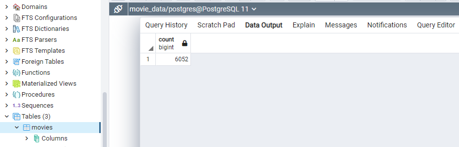
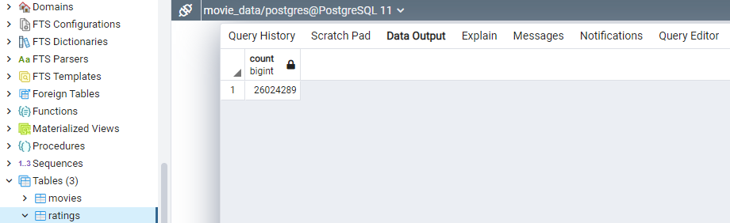

# Movies-ETL
# Create an ETL Pipeline that Autoloads into a Database
## Overview
 -	**Purpose:** Practice the creation and automation of WTL pipelines.
 -	**Discussion:** To gain experience in the automation of an “Extract/Transform/Load” (ETL) pipeline, three datasets related to movies were provided: a JSON file containing Wikipedia data and two CSV files, one comprised of Kaggle metadata and the other of MovieLens rating data.  The process started with preparing “cleaned” pandas.DataFrame objects from the three data sources.  This was followed by preparing a pandas.DataFrame object representing a merge of the Kaggle and Wikipedia data and loading both this and the MovieLens rating data CSV file into a PostgreSQL database. 

## Results
 -	An ETL pipeline was created that produced the desired DataFrame objects, and the raw MovieLens rating data along with data from a merged movie DataFrame object were successfully loaded into the database.  Using a “pgAdmin 4” interface, the two database tables were queried for their row counts and expected results were achieved (shown below):
 - 
 - 
